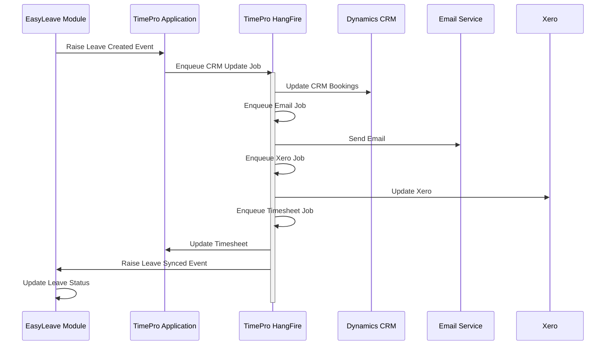

# EasyLeave Data Sync

```mermaid
sequenceDiagram
    participant EL as EasyLeave Module
    participant TP as TimePro Application
    participant HF as TimePro HangFire
    participant CRM as Dynamics CRM
    participant Email as Email Service
    participant Xero as Xero

    EL->>TP: Raise Leave Created Event
    TP->>HF: Enqueue CRM Update Job
    
    activate HF
    HF->>CRM: Update CRM Bookings
    HF->>HF: Enqueue Email Job
    HF->>Email: Send Email
    HF->>HF: Enqueue Xero Job
    HF->>Xero: Update Xero
    HF->>HF: Enqueue Timesheet Job
    HF->>TP: Update Timesheet
    HF->>EL: Raise Leave Synced Event
    EL->>EL: Update Leave Status
    deactivate HF
```
